# DOCUMENTACIÓN DE ANÁLISIS DEL SOFTWARE — CASOS DE USO

## PROYECTO: RENTAMOVIL — PLATAFORMA PARA EMPRESA DE ALQUILER DE VEHÍCULOS

**INTEGRANTES:** Thiago Fabian Rojas Guevara — David Santiago Erez Rodríguez — Nicole Dayana Ramírez Vargas

**SERVICIO NACIONAL DE APRENDIZAJE — SENA — ANÁLISIS Y DESARROLLO DE SOFTWARE 3145556**

**2026**

---

## 1. Introducción

Este documento presenta los casos de uso del sistema RentaMovil: qué puede hacer cada actor y bajo
qué condiciones. Es la primera de las cuatro vistas dinámicas del análisis del software; las otras
tres —diagramas de secuencia, de actividad y de estados— están en documentos separados dentro de
esta misma carpeta.

Cada caso de uso se presenta como una ficha individual: su propio diagrama, actor, descripción,
precondición, postcondición y el requisito funcional del SRS que implementa.

## 2. Actores del sistema

| Actor | Descripción |
|-------|-------------|
| Visitante | Persona sin sesión iniciada; solo puede explorar el catálogo y registrarse |
| Cliente | Usuario autenticado con rol `CLIENT`; gestiona sus propias reservas, pagos y perfil |
| Administrador | Usuario autenticado con rol `ADMIN`; gestiona la flota, las reservas y los pagos de toda la empresa |
| Super Admin | Usuario autenticado con rol `SUPER_ADMIN`; todo lo del Administrador, más la gestión de usuarios administrativos y de cuentas bancarias |

> Un Administrador o Super Admin también puede tener reservas propias, usando su misma cuenta
> como Cliente — el rol determina qué puede *administrar*, no qué puede *usar*.

## 3. Catálogo de casos de uso

| ID | Caso de uso | Actor |
|----|-------------|-------|
| UC01 | Explorar catálogo de vehículos | Visitante |
| UC02 | Registrarse | Visitante |
| UC03 | Iniciar sesión | Cliente |
| UC04 | Recuperar contraseña | Cliente |
| UC05 | Gestionar mi perfil | Cliente |
| UC06 | Crear una reserva | Cliente |
| UC07 | Ver y modificar mis reservas | Cliente |
| UC08 | Cancelar una reserva | Cliente |
| UC09 | Pagar una reserva | Cliente |
| UC10 | Consultar mis facturas | Cliente |
| UC11 | Ver mis notificaciones | Cliente |
| UC12 | Gestionar vehículos | Administrador |
| UC13 | Gestionar sucursales | Administrador |
| UC14 | Gestionar mantenimiento de la flota | Administrador |
| UC15 | Registrar recogida y devolución | Administrador |
| UC16 | Revisar comprobantes de pago | Administrador |
| UC17 | Administrar reservas de la empresa | Administrador |
| UC18 | Rastrear ubicación de vehículos | Administrador |
| UC19 | Gestionar planes de seguro | Administrador |
| UC20 | Gestionar usuarios administrativos | Super Admin |
| UC21 | Gestionar cuentas bancarias | Super Admin |

## 4. Fichas de casos de uso

### UC01 — Explorar catálogo de vehículos


| Campo | Valor |
|-------|-------|
| Actor | Visitante |
| RF relacionado | RF2.1 |
| Precondición | Ninguna — no requiere sesión iniciada |
| Postcondición | Se muestra el listado de vehículos `AVAILABLE`, con filtros opcionales |

**Descripción:** cualquier visitante puede ver y filtrar (categoría, marca, motor, precio, fechas)
el catálogo público de vehículos, sin necesidad de registrarse.

---

### UC02 — Registrarse

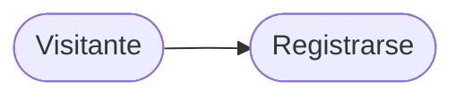

| Campo | Valor |
|-------|-------|
| Actor | Visitante |
| RF relacionado | RF1.1 |
| Precondición | El visitante no tiene cuenta en el sistema |
| Postcondición | Se crea una Person y un User con rol `CLIENT` |

**Descripción:** el visitante completa nombre, apellido, email, username, contraseña y,
opcionalmente, teléfono, para crear su cuenta de Cliente.

---

### UC03 — Iniciar sesión

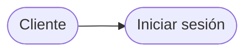

| Campo | Valor |
|-------|-------|
| Actor | Cliente |
| RF relacionado | RF1.2 |
| Precondición | El usuario tiene una cuenta con `status = ACTIVE` |
| Postcondición | Se emiten access token (30 min) y refresh token (7 días) |

**Descripción:** el usuario se autentica con su email o username y su contraseña.

---

### UC04 — Recuperar contraseña

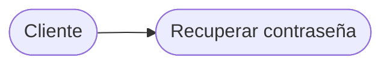

| Campo | Valor |
|-------|-------|
| Actor | Cliente |
| RF relacionado | RF1.3 |
| Precondición | El usuario olvidó su contraseña y tiene una cuenta registrada |
| Postcondición | La contraseña queda actualizada y todas sus sesiones se cierran |

**Descripción:** el usuario solicita un código de recuperación por email (6 dígitos, válido por 15
minutos) y lo usa junto con una contraseña nueva.

---

### UC05 — Gestionar mi perfil

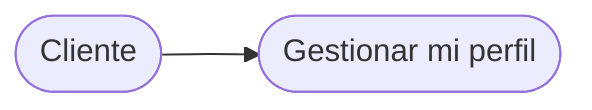

| Campo | Valor |
|-------|-------|
| Actor | Cliente |
| RF relacionado | RF1.4, RF1.5 |
| Precondición | El Cliente está autenticado |
| Postcondición | Los datos de perfil quedan actualizados |

**Descripción:** el Cliente actualiza nombre, teléfono, foto o email (este último, confirmando con
su contraseña actual), y puede cambiar su contraseña desde la sesión activa.

---

### UC06 — Crear una reserva

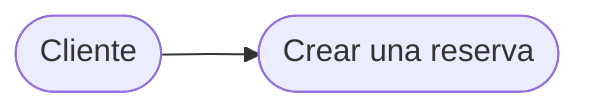

| Campo | Valor |
|-------|-------|
| Actor | Cliente |
| RF relacionado | RF3.1, RF2.2 |
| Precondición | Cliente autenticado; el vehículo elegido está disponible en las fechas solicitadas |
| Postcondición | `Reservation` creada en estado `PENDING_PAYMENT` |

**Descripción:** el Cliente selecciona vehículo, fechas, sucursales de recogida/devolución y,
opcionalmente, un seguro, y acepta los términos y condiciones.

---

### UC07 — Ver y modificar mis reservas

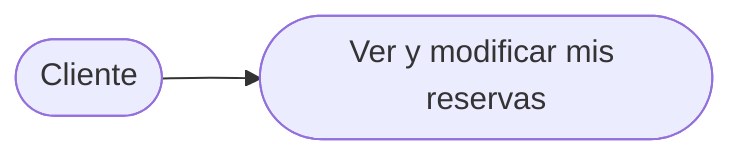

| Campo | Valor |
|-------|-------|
| Actor | Cliente |
| RF relacionado | RF3.2 |
| Precondición | El Cliente tiene al menos una reserva |
| Postcondición | La fecha de devolución o la sucursal de devolución quedan actualizadas |

**Descripción:** el Cliente consulta sus reservas y puede extender la fecha de devolución o cambiar
la sucursal de devolución, siempre con al menos 3 días de anticipación.

---

### UC08 — Cancelar una reserva

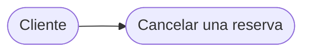

| Campo | Valor |
|-------|-------|
| Actor | Cliente |
| RF relacionado | RF3.3 |
| Precondición | Faltan 3 días o más para `start_date` |
| Postcondición | `Reservation.status = CANCELLED`, sin cargo |

**Descripción:** el Cliente cancela una reserva propia sin penalización, siempre que falten al
menos 3 días para la fecha de recogida.

---

### UC09 — Pagar una reserva

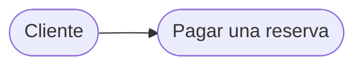

| Campo | Valor |
|-------|-------|
| Actor | Cliente |
| RF relacionado | RF5.1 |
| Precondición | Reserva en `PENDING_PAYMENT` |
| Postcondición | `Payment` creado en `PENDING_REVIEW`; reserva pasa a `PENDING_REVIEW` |

**Descripción:** el Cliente transfiere a la cuenta bancaria mostrada como código QR y sube el
comprobante de pago para que un Administrador lo revise.

---

### UC10 — Consultar mis facturas

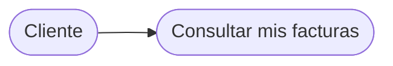

| Campo | Valor |
|-------|-------|
| Actor | Cliente |
| RF relacionado | RF5.2 |
| Precondición | El Cliente tiene al menos un pago aprobado |
| Postcondición | Se muestra o descarga el PDF de la factura |

**Descripción:** el Cliente consulta y descarga las facturas generadas automáticamente tras un
pago aprobado.

---

### UC11 — Ver mis notificaciones

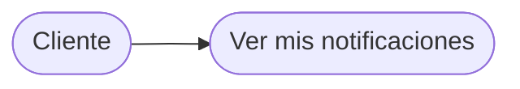

| Campo | Valor |
|-------|-------|
| Actor | Cliente |
| RF relacionado | RF7.1 |
| Precondición | El Cliente está autenticado |
| Postcondición | Las notificaciones consultadas pueden marcarse como leídas |

**Descripción:** el Cliente ve dentro de la aplicación las notificaciones generadas por eventos de
sus reservas y pagos.

---

### UC12 — Gestionar vehículos


| Campo | Valor |
|-------|-------|
| Actor | Administrador |
| RF relacionado | RF8.2 |
| Precondición | El Administrador está autenticado |
| Postcondición | El catálogo de vehículos queda actualizado |

**Descripción:** el Administrador registra, edita o elimina vehículos, y consulta el inventario
completo filtrando por estado.

---

### UC13 — Gestionar sucursales


| Campo | Valor |
|-------|-------|
| Actor | Administrador |
| RF relacionado | RF8.4 |
| Precondición | El Administrador está autenticado |
| Postcondición | La sucursal queda creada, editada o eliminada |

**Descripción:** el Administrador crea, edita o elimina sucursales, y puede ubicarlas en un mapa.

---

### UC14 — Gestionar mantenimiento de la flota


| Campo | Valor |
|-------|-------|
| Actor | Administrador |
| RF relacionado | RF8.3, RF8.7 |
| Precondición | El vehículo no está `RETIRED` |
| Postcondición | El mantenimiento queda programado, iniciado, completado o cancelado |

**Descripción:** el Administrador programa, inicia, completa o cancela mantenimientos de un
vehículo, y consulta su historial.

---

### UC15 — Registrar recogida y devolución


| Campo | Valor |
|-------|-------|
| Actor | Administrador |
| RF relacionado | RF4.1, RF4.2 |
| Precondición | Reserva en `CONFIRMED` (para la recogida) |
| Postcondición | `Rental` creado o completado; el estado del vehículo cambia |

**Descripción:** el Administrador registra, en sucursal, la entrega y la devolución física del
vehículo, con el kilometraje inicial y final.

---

### UC16 — Revisar comprobantes de pago


| Campo | Valor |
|-------|-------|
| Actor | Administrador |
| RF relacionado | RF5.1, RF8.5 |
| Precondición | Hay un `Payment` en `PENDING_REVIEW` |
| Postcondición | El pago queda `APPROVED` o `REJECTED` |

**Descripción:** el Administrador revisa el comprobante subido por el Cliente y decide aprobarlo o
rechazarlo.

---

### UC17 — Administrar reservas de la empresa


| Campo | Valor |
|-------|-------|
| Actor | Administrador |
| RF relacionado | RF8.5 |
| Precondición | El Administrador está autenticado |
| Postcondición | Se muestra el listado completo de reservas, con su información de pago |

**Descripción:** el Administrador consulta todas las reservas del sistema, no solo las propias, y
gestiona los planes de seguro disponibles.

---

### UC18 — Rastrear ubicación de vehículos


| Campo | Valor |
|-------|-------|
| Actor | Administrador |
| RF relacionado | RF6.1, RF6.2 |
| Precondición | El vehículo está o estuvo en estado `RENTED` |
| Postcondición | Se muestra la ubicación actual o el historial de rutas |

**Descripción:** el Administrador consulta la última ubicación de un vehículo alquilado o el
historial completo de un alquiler ya finalizado.

---

### UC19 — Gestionar planes de seguro


| Campo | Valor |
|-------|-------|
| Actor | Administrador |
| RF relacionado | RF8.5 |
| Precondición | El Administrador está autenticado |
| Postcondición | El plan de seguro queda creado o editado |

**Descripción:** el Administrador crea o edita los planes de seguro (First Aid, Standard,
All-Risk) que el Cliente puede elegir al reservar.

---

### UC20 — Gestionar usuarios administrativos

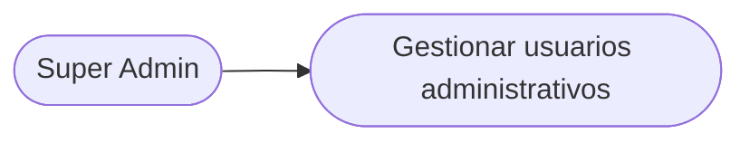

| Campo | Valor |
|-------|-------|
| Actor | Super Admin |
| RF relacionado | RF8.1 |
| Precondición | El Super Admin está autenticado |
| Postcondición | El rol o el estado de la cuenta quedan actualizados |

**Descripción:** el Super Admin otorga o revoca roles administrativos, y activa o desactiva
cuentas de usuario.

---

### UC21 — Gestionar cuentas bancarias

```mermaid
flowchart LR
    A(["Super Admin"]) --> B(["Gestionar cuentas bancarias"])
```

| Campo | Valor |
|-------|-------|
| Actor | Super Admin |
| RF relacionado | RF8.6 |
| Precondición | El Super Admin está autenticado |
| Postcondición | La cuenta bancaria queda creada, editada o desactivada |

**Descripción:** el Super Admin administra las cuentas bancarias de la empresa que se ofrecen como
destino de pago en el checkout.

---

## 5. Referencias

| Título del documento | Referencia |
|------------------------|------------|
| Especificación de Requisitos de Software | `01-informe-especificacion-requisitos/SRS.md` (este repositorio) |
| Diagramas de secuencia | `02-Diagramas-de-Secuencia.md` (esta carpeta) |
| Diagramas de actividad | `03-Diagramas-de-Actividad.md` (esta carpeta) |
| Diagramas de estados | `04-Diagramas-de-Estados.md` (esta carpeta) |
