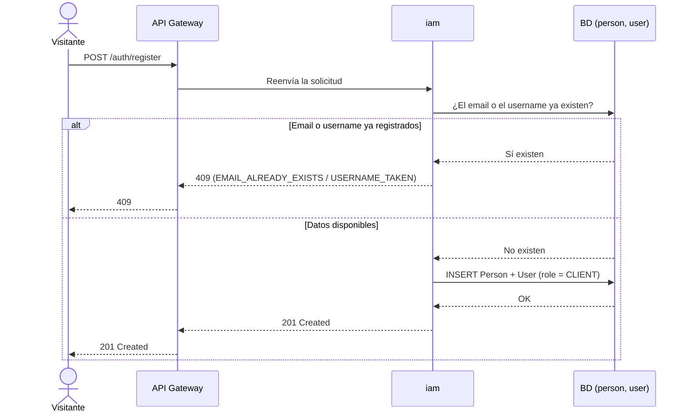
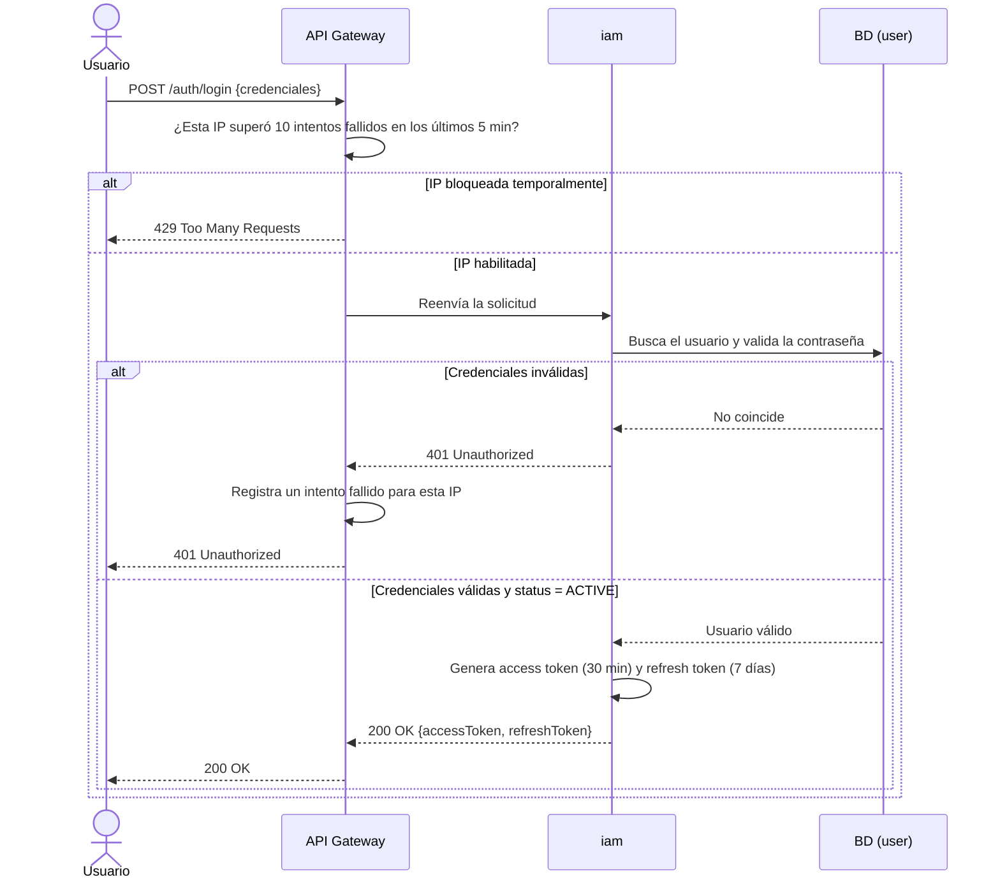
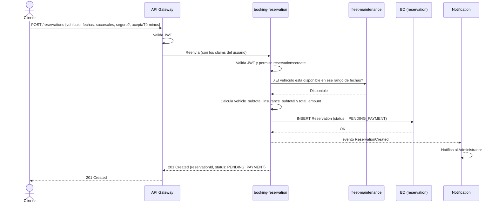
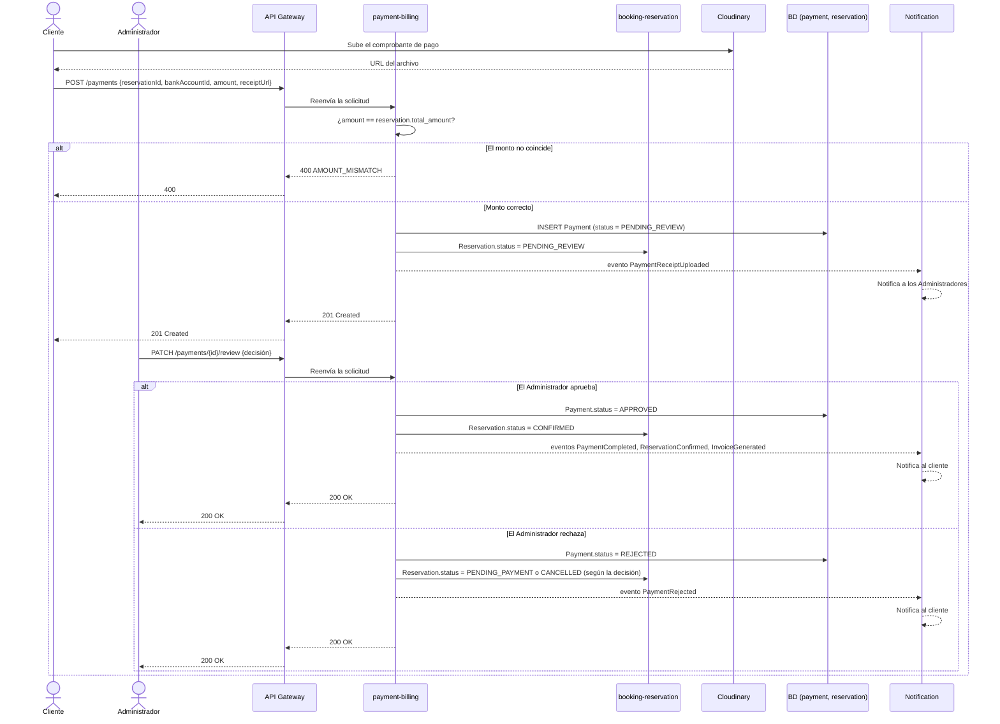
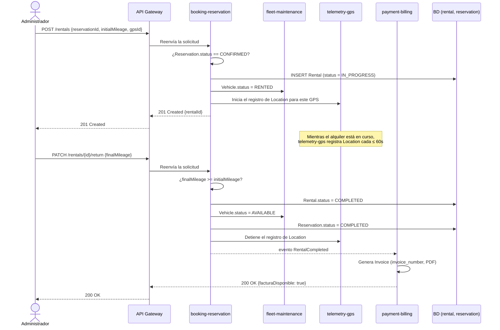
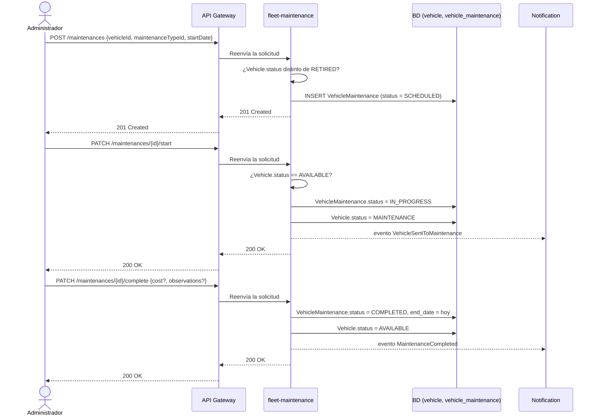
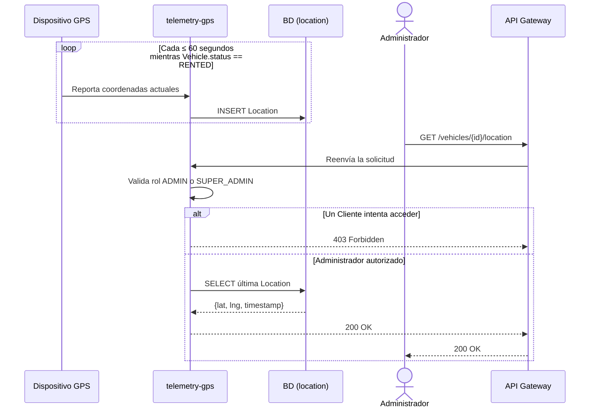

# DOCUMENTACIÓN DE ANÁLISIS DEL SOFTWARE — DIAGRAMAS DE SECUENCIA

## PROYECTO: RENTAMOVIL — PLATAFORMA PARA EMPRESA DE ALQUILER DE VEHÍCULOS

**INTEGRANTES:** Thiago Fabian Rojas Guevara — David Santiago Erez Rodríguez — Nicole Dayana Ramírez Vargas

**SERVICIO NACIONAL DE APRENDIZAJE — SENA — ANÁLISIS Y DESARROLLO DE SOFTWARE 3145556**

**2026**

---

## 1. Introducción

Este documento presenta los diagramas de secuencia de los flujos principales de RentaMovil: el
intercambio de mensajes entre el actor, el API Gateway, los microservicios y la base de datos para
cada operación. Es la segunda de las cuatro vistas dinámicas del análisis del software; los casos
de uso, los diagramas de actividad y los de estados están en documentos separados dentro de esta
misma carpeta.

**Nota sobre los nombres de servicio:** los diagramas usan los nombres de despliegue físico de los
microservicios (`api-gateway`, `iam`, `fleet-maintenance`, `booking-reservation`,
`payment-billing`, `telemetry-gps`), no los nombres conceptuales de Bounded Context del SRS. Los
flujos de Rental Execution y Notification, que en el SRS aparecen como contextos propios, se
ejecutan físicamente dentro de `booking-reservation` — son parte de su mismo ciclo de vida y no
necesitan desplegarse como servicios separados.

---

## SEQ-01 — Registro de cliente

| Campo | Valor |
|-------|-------|
| Actor | Visitante |
| RF relacionado | RF1.1 |
| Precondición | El visitante no tiene cuenta en el sistema |
| Postcondición | Se crea una Person y un User con rol `CLIENT` |

---

## SEQ-02 — Inicio de sesión

| Campo | Valor |
|-------|-------|
| Actor | Cliente (o cualquier usuario registrado) |
| RF relacionado | RF1.2 |
| Precondición | El usuario tiene una cuenta activa |
| Postcondición | Se emiten access token y refresh token |

---

## SEQ-03 — Crear una reserva

| Campo | Valor |
|-------|-------|
| Actor | Cliente |
| RF relacionado | RF3.1, RF2.2 |
| Precondición | Cliente autenticado; el vehículo existe |
| Postcondición | `Reservation` creada en `PENDING_PAYMENT`; el Administrador queda notificado |

---

## SEQ-04 — Pagar una reserva (revisión del comprobante)

| Campo | Valor |
|-------|-------|
| Actores | Cliente, Administrador |
| RF relacionado | RF5.1 |
| Precondición | Reserva en `PENDING_PAYMENT` |
| Postcondición | Reserva `CONFIRMED` (aprobado) o `PENDING_PAYMENT`/`CANCELLED` (rechazado) |

---

## SEQ-05 — Ejecutar el alquiler (recogida, devolución y factura)

| Campo | Valor |
|-------|-------|
| Actor | Administrador |
| RF relacionado | RF4.1, RF4.2, RF5.2 |
| Precondición | Reserva en `CONFIRMED` |
| Postcondición | `Rental` completado, `Vehicle` disponible de nuevo, factura generada |

---

## SEQ-06 — Programar y completar un mantenimiento

| Campo | Valor |
|-------|-------|
| Actor | Administrador |
| RF relacionado | RF8.3, RF8.7 |
| Precondición | El vehículo no está `RETIRED` |
| Postcondición | Mantenimiento `COMPLETED`; vehículo `AVAILABLE` de nuevo |

---

## SEQ-07 — Rastreo GPS en tiempo real

| Campo | Valor |
|-------|-------|
| Actor | Administrador |
| RF relacionado | RF6.1 |
| Precondición | El vehículo está en estado `RENTED` |
| Postcondición | Se devuelve la última ubicación registrada |

---

## Referencias

| Título del documento | Referencia |
|------------------------|------------|
| Especificación de Requisitos de Software | `01-informe-especificacion-requisitos/SRS.md` (este repositorio) |
| Casos de uso | `01-Casos-de-Uso.md` (esta carpeta) |
| Diagramas de actividad | `03-Diagramas-de-Actividad.md` (esta carpeta) |
| Diagramas de estados | `04-Diagramas-de-Estados.md` (esta carpeta) |
| Catálogo de eventos de dominio | repositorio `rtm-docs`, `02-domain/domain-events.md` |
| Catálogo de microservicios (despliegue físico) | repositorio `rtm-docs`, `09-microservices/service-catalog.md` |
