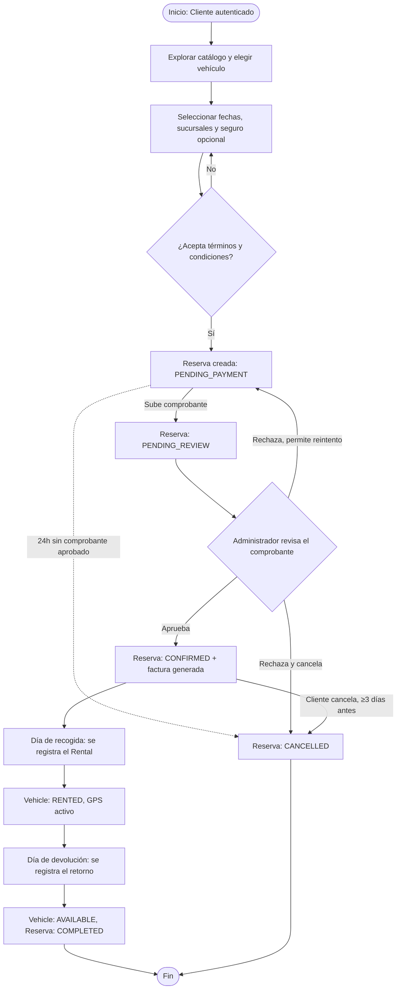
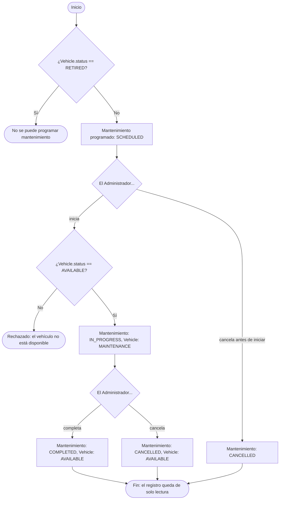

# DOCUMENTACIÓN DE ANÁLISIS DEL SOFTWARE — DIAGRAMAS DE ACTIVIDAD

## PROYECTO: RENTAMOVIL — PLATAFORMA PARA EMPRESA DE ALQUILER DE VEHÍCULOS

**INTEGRANTES:** Thiago Fabian Rojas Guevara — David Santiago Erez Rodríguez — Nicole Dayana Ramírez Vargas

**SERVICIO NACIONAL DE APRENDIZAJE — SENA — ANÁLISIS Y DESARROLLO DE SOFTWARE 3145556**

**2026**

---

## 1. Introducción

Este documento presenta los diagramas de actividad de los dos procesos de negocio más complejos de
RentaMovil: el ciclo completo de una reserva y el ciclo de mantenimiento de un vehículo. Es la
tercera de las cuatro vistas dinámicas del análisis del software; los casos de uso, los diagramas
de secuencia y los de estados están en documentos separados dentro de esta misma carpeta.

---

## ACT-01 — Proceso de reserva y pago

| Campo | Valor |
|-------|-------|
| RF relacionados | RF3.1, RF3.3, RF5.1, RF5.2, RF4.1, RF4.2 |
| Descripción | Recorre una reserva desde que el Cliente elige el vehículo hasta que el alquiler termina y queda facturado, incluyendo los caminos de rechazo, reintento, cancelación y expiración automática |

---

## ACT-02 — Proceso de mantenimiento de un vehículo

| Campo | Valor |
|-------|-------|
| RF relacionados | RF8.3, RF8.7 |
| Descripción | Recorre el ciclo de vida de un mantenimiento, desde que se programa hasta que se completa o se cancela |

---

## Referencias

| Título del documento | Referencia |
|------------------------|------------|
| Especificación de Requisitos de Software | `01-informe-especificacion-requisitos/SRS.md` (este repositorio) |
| Casos de uso | `01-Casos-de-Uso.md` (esta carpeta) |
| Diagramas de secuencia | `02-Diagramas-de-Secuencia.md` (esta carpeta) |
| Diagramas de estados | `04-Diagramas-de-Estados.md` (esta carpeta) |
