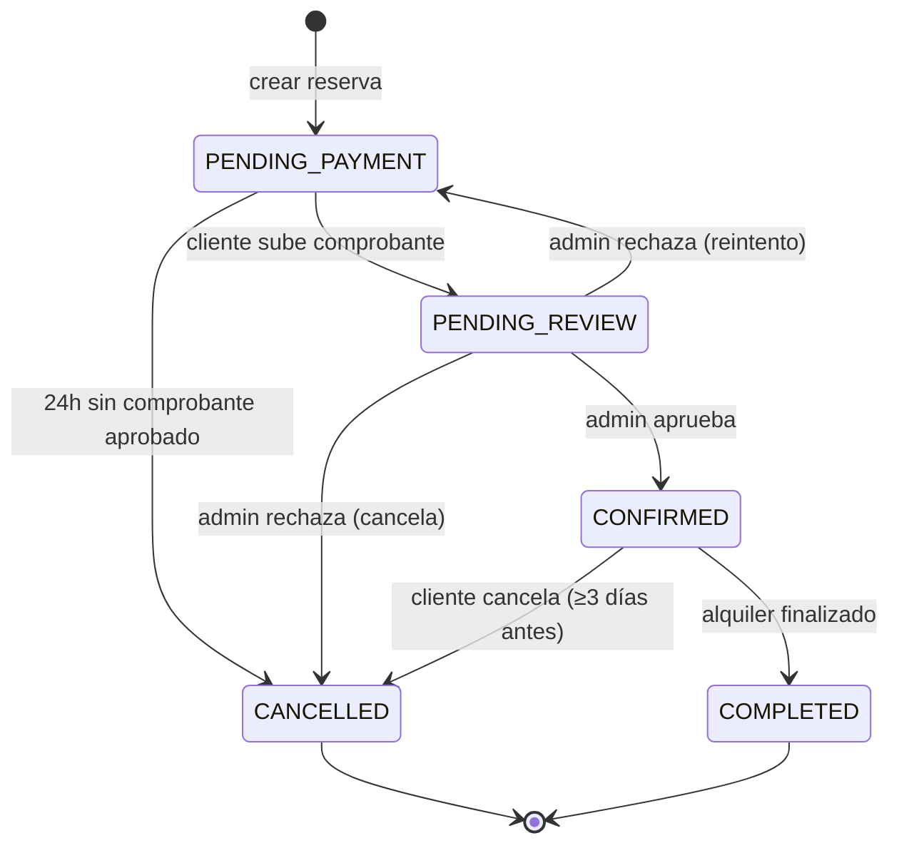
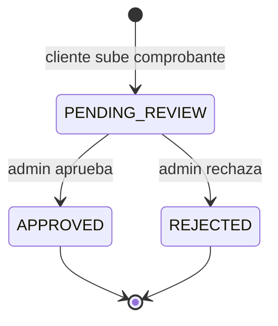
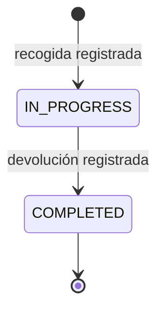
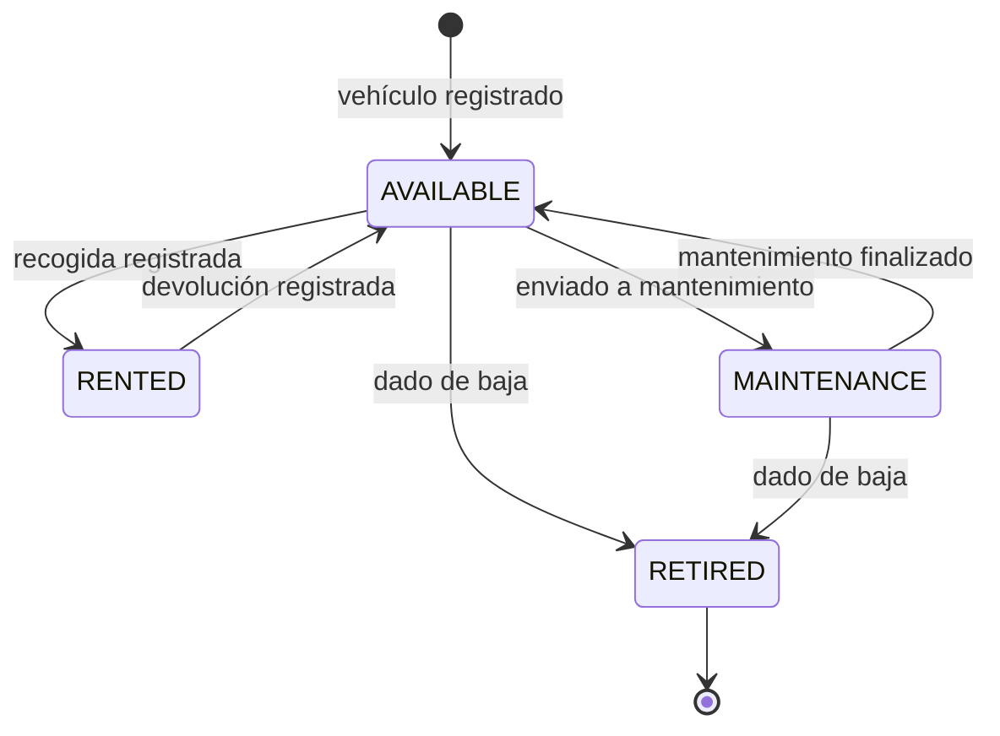
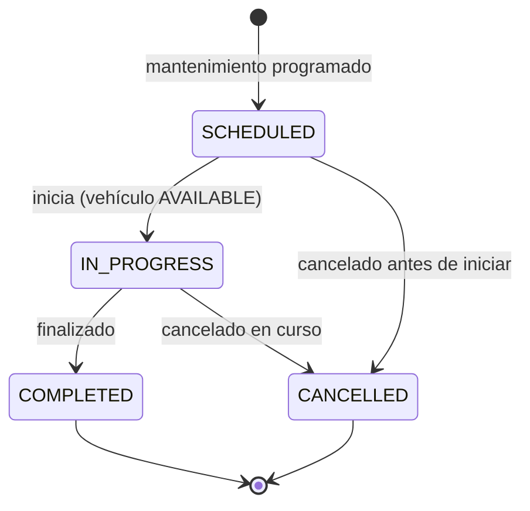

# DOCUMENTACIÓN DE ANÁLISIS DEL SOFTWARE — DIAGRAMAS DE ESTADOS

## PROYECTO: RENTAMOVIL — PLATAFORMA PARA EMPRESA DE ALQUILER DE VEHÍCULOS

**INTEGRANTES:** Thiago Fabian Rojas Guevara — David Santiago Erez Rodríguez — Nicole Dayana Ramírez Vargas

**SERVICIO NACIONAL DE APRENDIZAJE — SENA — ANÁLISIS Y DESARROLLO DE SOFTWARE 3145556**

**2026**

---

## 1. Introducción

Este documento presenta el ciclo de vida de las cinco entidades centrales del negocio de
RentaMovil. Es la cuarta de las cuatro vistas dinámicas del análisis del software; los casos de
uso, los diagramas de secuencia y los de actividad están en documentos separados dentro de esta
misma carpeta.

---

## EST-01 — Reservation

| Campo | Valor |
|-------|-------|
| RF relacionado | RF3.1, RF3.2, RF3.3, RF5.1 |

---

## EST-02 — Payment

| Campo | Valor |
|-------|-------|
| RF relacionado | RF5.1 |

---

## EST-03 — Rental

| Campo | Valor |
|-------|-------|
| RF relacionado | RF4.1, RF4.2 |

---

## EST-04 — Vehicle

| Campo | Valor |
|-------|-------|
| RF relacionado | RF8.2, RF8.3 |

---

## EST-05 — VehicleMaintenance

| Campo | Valor |
|-------|-------|
| RF relacionado | RF8.7 |

---

## Referencias

| Título del documento | Referencia |
|------------------------|------------|
| Especificación de Requisitos de Software | `01-informe-especificacion-requisitos/SRS.md` (este repositorio) |
| Casos de uso | `01-Casos-de-Uso.md` (esta carpeta) |
| Diagramas de secuencia | `02-Diagramas-de-Secuencia.md` (esta carpeta) |
| Diagramas de actividad | `03-Diagramas-de-Actividad.md` (esta carpeta) |
| Reglas de negocio y ciclos de vida de las entidades | repositorio `rtm-docs`, `02-domain/entities-and-rules.md` |
